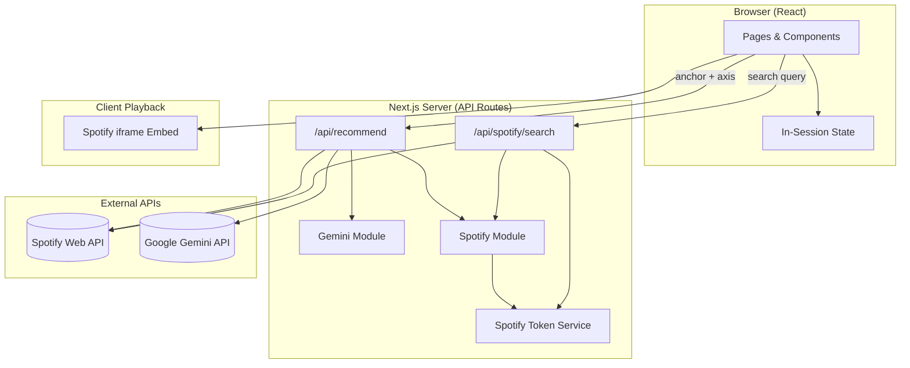
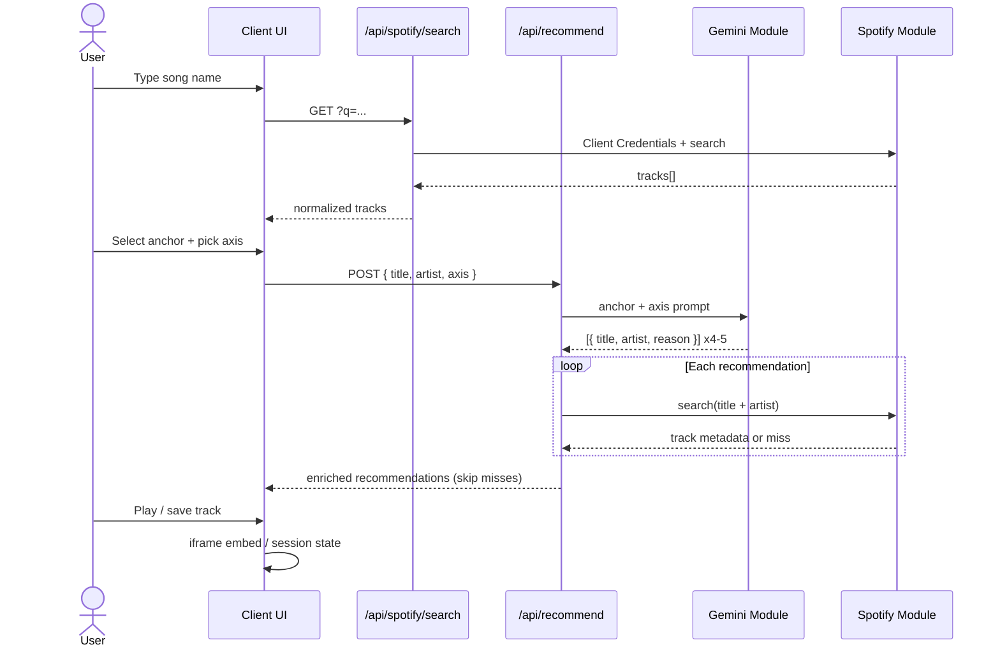
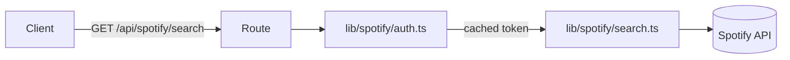
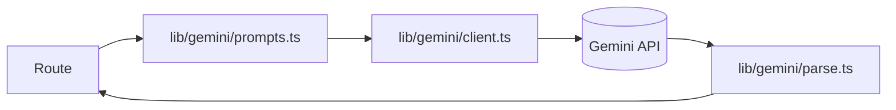
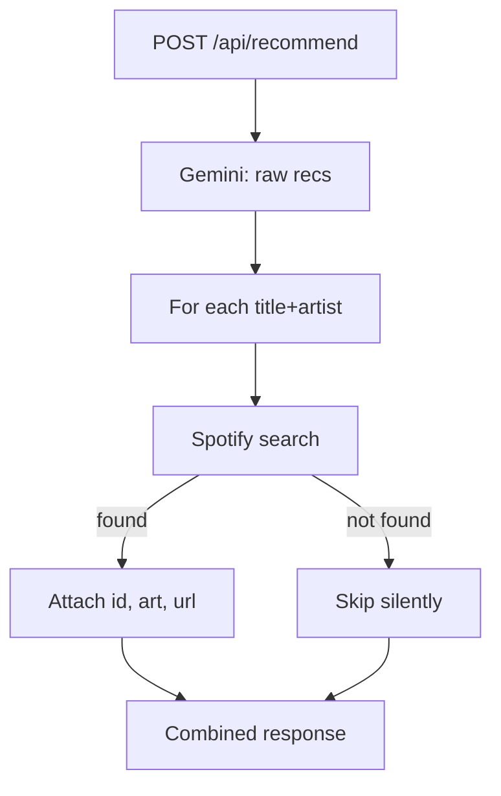
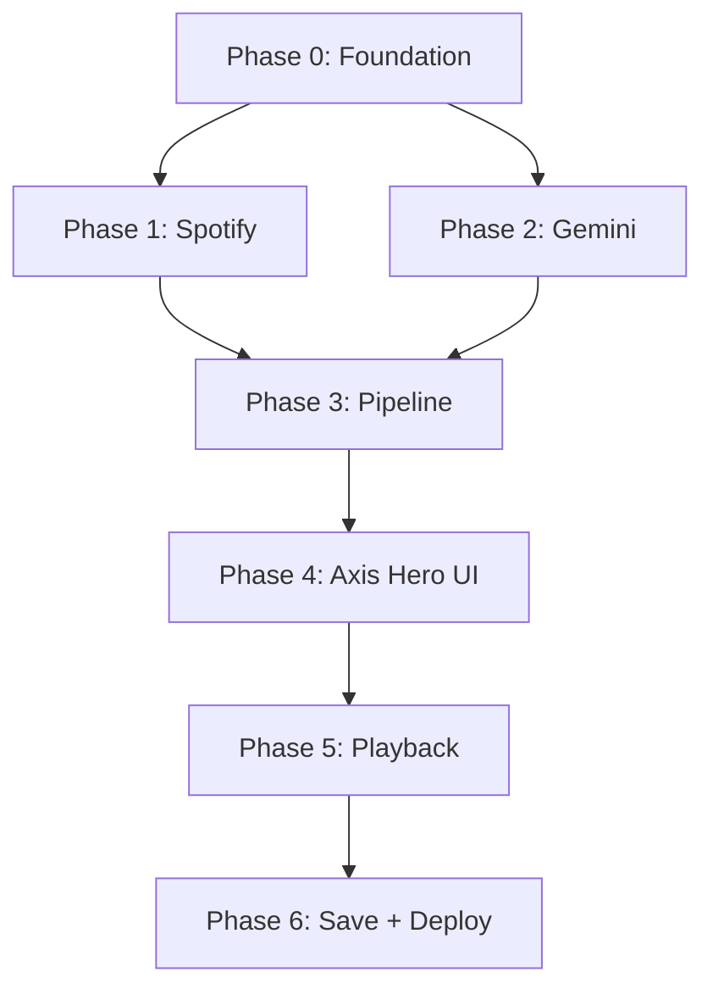

# Axis — Phase-Wise Architecture

This document breaks the Axis build into incremental phases. Each phase has a clear goal, deliverables, data flow, and a test checkpoint. **Do not start the next phase until the current one passes its checkpoint.**

Related: [problemstatement.md](./problemstatement.md)

---

## System Overview



### Responsibility Split

| Layer | Responsibility |
|-------|----------------|
| **Client** | Search UI, axis selector, results, loading/error states, session save list, Spotify embeds |
| **API routes** | Auth secrets, call Spotify/Gemini, normalize responses, error handling |
| **`lib/spotify`** | Client Credentials token cache, search, track lookup |
| **`lib/gemini`** | Prompt construction, LLM call, JSON parse & validation |
| **`lib/types`** | Shared TypeScript types for tracks, axes, recommendations |

---

## Planned File Structure

Full target layout (files appear as each phase adds them):

```
axis/
├── app/
│   ├── layout.tsx                 # Root layout, Montserrat, dark theme
│   ├── page.tsx                   # Main discovery screen
│   ├── globals.css                # Spotify color tokens, base styles
│   └── api/
│       ├── spotify/
│       │   └── search/
│       │       └── route.ts       # GET — search tracks by query
│       └── recommend/
│           └── route.ts           # POST — anchor + axis → enriched recs
├── components/
│   ├── SearchBar.tsx              # Anchor song search
│   ├── SearchResults.tsx          # Pick anchor from Spotify results
│   ├── AxisSelector.tsx           # Hero segmented pill (3 axes)
│   ├── RecommendationList.tsx     # Results for active axis
│   ├── TrackRow.tsx               # Album art, title, artist, save btn
│   ├── SpotifyEmbed.tsx           # iframe player wrapper
│   ├── PlayerBar.tsx              # Persistent bottom bar
│   ├── SavedList.tsx              # In-session liked tracks
│   ├── LoadingState.tsx
│   └── ErrorBanner.tsx
├── lib/
│   ├── spotify/
│   │   ├── auth.ts                # Client Credentials + token cache
│   │   ├── search.ts              # Search & track lookup helpers
│   │   └── types.ts               # Spotify response shapes
│   ├── gemini/
│   │   ├── client.ts              # Gemini API wrapper (swappable)
│   │   ├── prompts.ts             # Axis-specific prompt templates
│   │   └── parse.ts               # Strip fences, safe JSON parse
│   ├── types/
│   │   └── index.ts               # Axis, Track, Recommendation types
│   └── constants.ts               # Axis labels, colors, limits
├── hooks/
│   ├── useRecommendations.ts      # Fetch recs when anchor/axis changes
│   └── useSavedTracks.ts          # Session save list state
├── .env.local.example
├── next.config.ts
├── package.json
└── vercel.json                    # Optional deploy hints
```

---

## Data Flow — End State



### API Contracts

**`GET /api/spotify/search?q={query}`**

```json
{
  "tracks": [
    {
      "id": "spotify:track:...",
      "title": "Song Name",
      "artist": "Artist Name",
      "albumArtUrl": "https://...",
      "spotifyUrl": "https://open.spotify.com/track/..."
    }
  ]
}
```

**`POST /api/recommend`**

Request:
```json
{
  "anchor": { "title": "...", "artist": "..." },
  "axis": "beat" | "mood" | "lyrics"
}
```

Response:
```json
{
  "recommendations": [
    {
      "title": "...",
      "artist": "...",
      "reason": "Matched on driving four-on-the-floor beat, not lyrics.",
      "spotifyId": "...",
      "albumArtUrl": "...",
      "spotifyUrl": "..."
    }
  ],
  "axis": "beat"
}
```

---

## Phase Plan

### Phase 0 — Project Foundation

**Goal:** Runnable Next.js app with env wiring and deployment skeleton.

| Deliverable | Details |
|-------------|---------|
| Next.js App Router scaffold | TypeScript, ESLint |
| Design tokens in `globals.css` | `#121212`, `#1DB954`, `#B3B3B3`, Montserrat |
| `.env.local.example` | `SPOTIFY_CLIENT_ID`, `SPOTIFY_CLIENT_SECRET`, `GEMINI_API_KEY` |
| Root layout | Dark background, font loaded |
| Placeholder home page | Confirms app runs |

**Checkpoint:** `npm run dev` loads a dark-themed page. Env vars documented. Vercel project can be linked (no APIs yet).

---

### Phase 1 — Spotify Integration

**Goal:** Server-side Spotify search with Client Credentials — no deprecated endpoints.



| Deliverable | Details |
|-------------|---------|
| `lib/spotify/auth.ts` | Fetch & cache access token (refresh before expiry) |
| `lib/spotify/search.ts` | Search tracks; normalize to internal `Track` type |
| `app/api/spotify/search/route.ts` | Query param validation, try/catch, error JSON |
| `SearchBar` + `SearchResults` | Minimal UI — type query, show art/title/artist |
| `ErrorBanner` + `LoadingState` | Reusable feedback components |

**Constraints:** Use only search-related endpoints. No audio-features, audio-analysis, or recommendations.

**Checkpoint:** Search for a known song returns real Spotify results with album art. Invalid/missing env vars show a clear error. Empty query handled gracefully.

---

### Phase 2 — Gemini Similarity Engine

**Goal:** Isolated LLM module that returns axis-aware recommendations as strict JSON.



| Deliverable | Details |
|-------------|---------|
| `lib/gemini/prompts.ts` | Three axis templates with explicit match/ignore rules |
| `lib/gemini/client.ts` | Single swap point for model/provider (`gemini-2.5-flash`) |
| `lib/gemini/parse.ts` | Strip markdown fences, parse JSON, validate shape |
| `app/api/recommend/route.ts` | Accept anchor + axis; return raw Gemini results (no Spotify enrich yet) |
| Temporary test UI or curl | POST anchor + each axis, inspect JSON |

**Prompt rules (per axis):**

| Axis | Key instruction |
|------|-----------------|
| `beat` | Match tempo, rhythm, energy, production — ignore lyrics & mood |
| `mood` | Match emotional atmosphere — genre/tempo may differ |
| `lyrics` | Match themes & storytelling — sound may differ entirely |

**Checkpoint:** For a fixed anchor (e.g. *Blinding Lights*), all three axes return 4–5 songs with dimension-specific reasons. Output is valid JSON with no fences. Anchor song excluded from results.

---

### Phase 3 — Recommendation Pipeline (Gemini + Spotify Enrich)

**Goal:** Full server pipeline: Gemini suggestions → Spotify lookup → enriched, playable-ready response.



| Deliverable | Details |
|-------------|---------|
| Enrichment in `route.ts` | Parallel or sequential Spotify lookups per rec |
| Graceful skip | Missing tracks omitted, never 500 |
| `useRecommendations` hook | Client fetch on anchor/axis change |
| `RecommendationList` + `TrackRow` | Show art, title, artist, reason (no player yet) |

**Checkpoint:** Select anchor → pick axis → see 3–5 enriched rows with real album art. Unfindable Gemini songs skipped without crash. Loading spinner visible during fetch.

---

### Phase 4 — Axis Selector & Hero Interaction

**Goal:** Make axis switching the centerpiece — same anchor, visibly different results.

| Deliverable | Details |
|-------------|---------|
| `AxisSelector.tsx` | Segmented pill: Beat & energy / Mood & vibe / Lyrical theme |
| `lib/constants.ts` | Axis IDs, labels, display copy |
| Transition UX | Loading state on axis change; optional fade between result sets |
| Layout | Axis selector prominent above results; anchor song pinned visible |

**Checkpoint:** With one anchor locked in, toggling beat → mood → lyrics produces clearly different sets and reasons. UI feels intentional, not accidental refresh. No full-page reload on axis change.

---

### Phase 5 — Playback & Spotify Chrome

**Goal:** Real audio samples and native Spotify shell.

| Deliverable | Details |
|-------------|---------|
| `SpotifyEmbed.tsx` | iframe from track URL/ID |
| `PlayerBar.tsx` | Persistent bottom bar; shows now-playing from selected row |
| Row play interaction | Click play on row → updates embed / player bar |
| Polish `layout.tsx` + `globals.css` | Row hover, spacing, typography match Spotify patterns |

**Checkpoint:** User can play at least one 30s preview per result via embed. Bottom bar persists while browsing. Layout reads as “inside Spotify” at a glance.

---

### Phase 6 — Session Save List & Production Hardening

**Goal:** Complete user flow, error resilience, Vercel deploy.

| Deliverable | Details |
|-------------|---------|
| `useSavedTracks.ts` + `SavedList.tsx` | Heart/save toggle; dedupe by spotifyId; session-only |
| Error handling audit | All API routes return structured errors; client shows `ErrorBanner` |
| Empty states | No results, all recs skipped, search miss |
| Vercel deploy | Env vars in dashboard; production smoke test |
| README snippet | Setup steps + env table (optional, if requested) |

**Checkpoint:** Full flow works in production: search → anchor → switch axes → play → save. Errors show friendly messages. No secrets in client bundle.

---

## Phase Dependency Graph



Phases 1 and 2 can run **in parallel** after Phase 0. Phase 3 merges both. Phases 4–6 are sequential.

---

## Cross-Cutting Concerns (All Phases)

| Concern | Approach |
|---------|----------|
| **Secrets** | Server-only env vars; never `NEXT_PUBLIC_*` for API keys |
| **Token cache** | In-memory on server (sufficient for Vercel serverless; refresh on 401) |
| **Types** | Shared `Track`, `Axis`, `Recommendation` in `lib/types` |
| **LLM swap** | All Gemini usage through `lib/gemini/client.ts` only |
| **Spotify limits** | Debounce search input (~300ms); cap enrich concurrency if needed |
| **Testing** | Manual checkpoint per phase; optional API route tests in Phase 3+ |

---

## Suggested Build Order Summary

| Phase | Focus | You can demo… |
|-------|--------|----------------|
| 0 | Scaffold + theme + env | Dark Spotify-styled shell |
| 1 | Spotify search | Real song search with album art |
| 2 | Gemini axes | Different recs per axis (API/JSON) |
| 3 | Full pipeline | Enriched recommendation rows |
| 4 | Axis hero UI | Axis toggle changes results visibly |
| 5 | Playback | Hear real samples |
| 6 | Save + deploy | Complete production demo |

---

## Approval Gate

Confirm this phase plan and file structure before Phase 0 implementation. Adjustments (e.g. merge Phase 4 into Phase 3, rename routes) can be made here without rework if agreed upfront.
